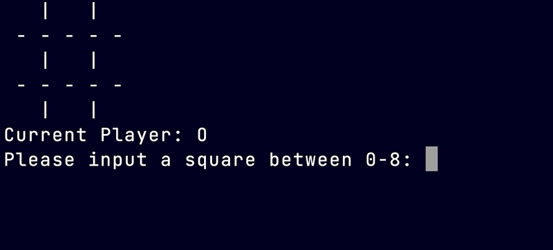

# Snake-Tac-Toe

> Command line Tic-Tac-Toe game written in Python in 2 hours as a group project

# Tech

- Python

# Challenges

We were required to implement classes in this Python coding exercises, so our group started by brainstorming the various entities present in a game of Tic Tac Toe, and which of those would be best represented by a class, and which would be better represented as properties of a class instance. The two classes we decided on were:

- `Game`: would represent rounds of the game, and would keep track of who's turn it was, which squares were filled, etc
- `GamePiece`: would represent the objects filling each square on the `Game`'s `gameboard[]` list.
